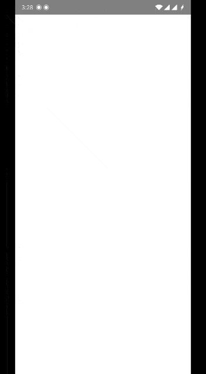

# Put title of your app here

<!--- Replace <OWNER> with your Github Username and <REPOSITORY> with the name of your repository. -->
<!--- You can find both of these in the url bar when you open your repository in github. -->


## :scroll: Description
A Puppy Adoption App , with 3 screens and Animations: 1) Splash Screen with Enter and Exit Animation, 2) List Screen showing various available puppies and Enter Animation, 3) Selected Puppy Details.
Whole App's UI and Animations Made using jetpack Compose.

## :bulb: Motivation and Context
<!--- Optionally point readers to interesting parts of your submission. -->
<!--- What are you especially proud of? -->
1.An extra Splash Screen with enter and exit Animations Added for an elegant welcome of App's Users.
2.Animation in List Screen to Slide IN upon being visible.
3.MVVM arch
4.Concise and descriptive Code.



## :camera_flash: Screenshots
<!-- You can add more screenshots here if you like -->
&emsp;&emsp;

## License
```
Copyright 2020 The Android Open Source Project

Licensed under the Apache License, Version 2.0 (the "License");
you may not use this file except in compliance with the License.
You may obtain a copy of the License at

    https://www.apache.org/licenses/LICENSE-2.0

Unless required by applicable law or agreed to in writing, software
distributed under the License is distributed on an "AS IS" BASIS,
WITHOUT WARRANTIES OR CONDITIONS OF ANY KIND, either express or implied.
See the License for the specific language governing permissions and
limitations under the License.
```